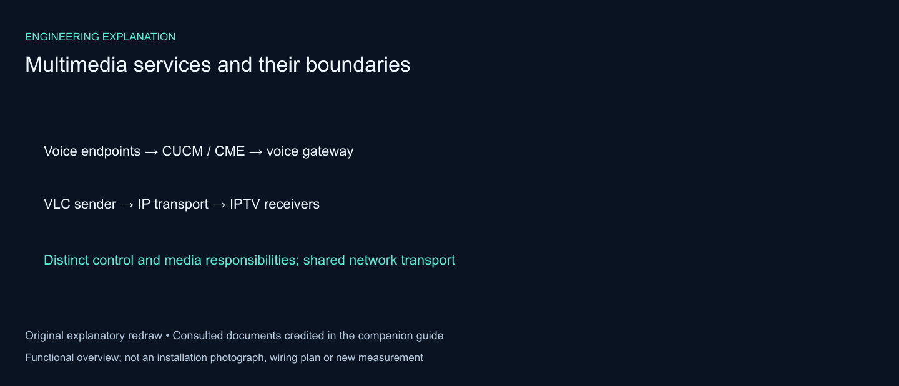

# IMS Multimedia Services — VoIP, IPTV & VoLTE

[Read case study](https://mahyoub88.github.io/projects/proj-ims-voip-volte/) · [Project index](docs/PROJECTS.md) · [Engineering guide](docs/engineering-guide.md)


**Team project — contributor:** Mohammed Mahyoub. See the documented scope below.

IP multimedia services built around an **IP Multimedia Subsystem (IMS)** core, in two parts:

- **Part A — Project implementation.**
  - **VoIP:** Cisco Unified Communications (CUCM 8.6 on VMware, three-router GNS3 voice network, branch CME, SCCP/SIP phones, Extension Mobility).
  - **IPTV:** LAN streaming with VLC to laptops and phones.
  - **VoLTE:** OPNET Modeler simulation of voice over an LTE-like access network connected to an IMS core and the PSTN.
  - **Case study:** IMS integration between a fixed-line operator (PTC) and a mobile operator (Yemen Mobile).
- **Part B — Reproducible open-source lab.**
  - **IMS core:** Kamailio P-CSCF/S-CSCF and an Asterisk application server.
  - **QoS:** DiffServ QoS for voice on a congested trunk.
  - **IPTV:** multicast with IGMP snooping.
  - **Measurement:** everything runs from one script with measured results.

**Stack:** IMS · SIP · H.323 · Cisco CUCM 8.6 · Cisco CME · GNS3 · VMware · VLC · OPNET Modeler 14.5 · Kamailio · Asterisk · SIPp · Mininet · Open vSwitch · DiffServ · FFmpeg · Python

---

## Part A — Project implementation

### A1. VoIP: Cisco Unified Communications

**Platform:**

- **Call control:** CUCM 8.6 installed on VMware Workstation, managed from its CLI and the web administration pages.
- **Voice network:** a three-router network built in GNS3 and bridged to the CUCM server.

| Node | Role | Addressing |
|---|---|---|
| VGW | HQ voice gateway, H.323 toward CUCM (192.168.154.10) | 192.168.154.0/24 |
| BR1 | Branch router running Cisco Unified **CME** | WAN 10.10.10.0/32 · LAN 192.168.20.0/24 |
| PSTN | PSTN-side router | 192.168.30.0/24 |

| CUCM on VMware (CLI) | CUCM web administration | GNS3 voice network |
|---|---|---|
|  |  |  |

**Gateway and branch configuration:** full excerpts are in [`config/cisco/`](config/cisco/).

- **Dial-peers.** VoIP dial-peers route each number range between CUCM, the branch and the PSTN, for example `9...` and `1339...` to CUCM, and `5...` and `3225...` to the PSTN side.
- **Codec and signalling.**
  - **Codec:** `voice class codec 5` with G.711 µ-law.
  - **H.323:** `voice class h323 5`, with short H.225 timers so calls fail over quickly.
  - **DTMF:** relayed over H.245.
- **Interworking:** `allow-connections` for H.323↔H.323, H.323↔SIP and SIP↔SIP.
- **Branch survivability:** BR1 runs `telephony-service` (CME). Branch phones keep internal calling if the WAN to CUCM fails, and calls to the HQ range go across the WAN when it is up.
- **CUCM:**
  - **Time:** NTP, with the Windows Time service as the phones' time source, plus Date/Time Groups.
  - **Phones:** provisioned over TFTP.
  - **Extension Mobility:** service, parameters, default and user device profiles, user association and phone subscription.
- **Endpoints:** Cisco IP Communicator (SCCP), X-Lite and Media5-fone on Android (SIP).

```cfg
voice service voip
 allow-connections h323 to h323
 allow-connections h323 to sip
 allow-connections sip to h323
 allow-connections sip to sip
!
voice class codec 5
 codec preference 1 g711ulaw
!
dial-peer voice 9 voip
 destination-pattern 9...
 voice-class codec 5
 voice-class h323 5
 session target ipv4:192.168.154.10
 dtmf-relay h245-alphanumeric
 no vad
```

| VGW dial-peers | VGW codec / H.323 / interworking | BR1 CME telephony-service | PSTN dial-peers |
|---|---|---|---|
|  |  |  |  |

| Phones registered in CUCM | Media5-fone (SIP) on Android |
|---|---|
|  |  |

**Result:** calls completed end-to-end between CUCM, branch and PSTN phones with low delay and good voice quality.

### A2. IPTV

- **Streaming:** VLC streams over the LAN (HTTP and UDP), with optional transcoding to save bandwidth.
- **Viewers:** laptops and mobile phones on the same network watched the channel by opening the stream address.

| VLC network stream | Watching the stream on a phone |
|---|---|
|  |  |

### A3. VoLTE: OPNET Modeler 14.5

OPNET 14.5 has no native VoLTE model. The LTE access network was therefore built from the WiMAX (802.16e) model and tuned to behave like LTE.

| Component | Value |
|---|---|
| Cells / base stations | 4 (eNodeB role), 1 km radius, 240 s simulation |
| PHY | OFDMA 20 MHz profile, 2048 subcarriers, FDD |
| Frequency | 10 GHz base, 50 MHz bandwidth |
| Antenna | STC 2×1 MIMO |
| QoS class | "Gold", UGS scheduling, classifier match = interactive voice |
| Application | Voice, PCM-quality speech |
| IMS core | P-CSCF, I-CSCF, S-CSCF (SIP proxies), HSS |
| Interworking | ASN gateway, IP cloud, PSTN switch with two phones |
| Mobility | mobile UE on a multi-cell trajectory |


| Voice traffic and cell handovers | Jitter |
|---|---|
|  |  |
| **Throughput** | **PSTN phones sending and receiving voice** |
|  |  |

**Observations:**

- **Handovers:** voice-traffic dips line up with cell handovers along the UE trajectory.
- **Jitter:** stayed close to zero.
- **Delay:** access delay was a few milliseconds, higher only at the start of movement.
- **PSTN interworking:** PSTN-side phones sent and received voice through the IMS core.

### A4. Case study: IMS for a fixed-line and a mobile operator

Three ways for the Public Telecommunication Corporation (PTC) and Yemen Mobile (YM) to adopt IMS, including interconnection with other operators over SIP and SS7:

1. **NGN → IMS upgrade.** Some NGN components are reused and the rest are replaced, at about 70 % of the cost of a new IMS.
2. **Converged core.** One core with two domains:
   - **HSS / SLF:** one HSS per operator, or a shared HSS with two domains.
   - **SBC:** one SBC with firewall per operator, or one SBC with two domains.
   - **PCRF:** one per operator, or shared.
   - **PTC side:** MGCF, AGCF and IM-MGW, with H.248 toward the MSAN.
   - **Packet core:** a single EPC, with YM's RAN upgraded to eNodeB.
3. **Two new IMS cores.** Each operator gets its own application servers, plus MVNO/VNO gateways and an eNodeB upgrade.

| Separate HSS per operator with SLF | Shared HSS with two domains |
|---|---|
|  |  |

### A5. Project authorship

- **Design, implementation, testing and documentation:** Mohammed Mahyoub.
- **Screenshots:** all screenshots in `docs/project/` are from the project's implementation.

---

## Part B — Reproducible open-source lab

The same service areas, rebuilt with open-source tools so they can be run and measured on any Linux machine:

- **IMS core.** Kamailio runs as the **P-CSCF** and the **S-CSCF**, and Asterisk as the **Application Server**. Registration uses HTTP-digest authentication, terminating calls are routed via Path, and service numbers go to the AS through an initial-filter-criteria rule.
- **VoIP QoS.** G.711 calls run over a congested 10 Mbit/s trunk, with and without a DiffServ priority queue (media EF, SIP CS3).
- **IPTV.** One channel goes to three set-top hosts, first as unicast and then as multicast with IGMP snooping.

All numbers below come from `results/results.json`, produced by `experiments/run_lab.py`. The following are in `results/logs/`; packet captures (`*.pcap`) are also written there when you run the lab, but they are not committed:

- SIP message logs
- queue counters
- per-packet delay series
- Kamailio and Asterisk logs


### B1. Lab architecture

| Host | IP | Role |
|---|---|---|
| `pcscf` | 10.0.0.10 | **P-CSCF**: Kamailio stateful proxy. Record-Route, adds `Path` on REGISTER, forwards to S-CSCF |
| `scscf` | 10.0.0.11 | **S-CSCF**: Kamailio registrar. Digest auth against the subscriber table (HSS stand-in), `lookup("location")` with Path, iFC → AS |
| `as` | 10.0.0.12 | **AS**: Asterisk 20 / PJSIP. **600** = echo service, **700** = announcement service |
| `ue1`–`ue4` | 10.0.0.1–4 | UEs (SIPp scenarios), subscribers 1001–1004 |
| `iptv` | 10.0.0.20 | IPTV head-end (FFmpeg, MPEG-TS over UDP) |
| `tv1`–`tv3` | 10.0.0.21–23 | Set-top receivers (`tools/ts_receiver.py`) |
| `bg` → `sink` | .30 → .31 | 12 Mbit/s UDP background load (iperf3) |

The three switches are Open vSwitch L2 learning switches, run in userspace so the lab also works without the OVS kernel module. In Experiment 2 the `s2 → s3` trunk is shaped to 10 Mbit/s with HTB.

```
ims/kamailio/pcscf.cfg      P-CSCF routing logic
ims/kamailio/scscf.cfg      S-CSCF registrar, digest auth, iFC, location lookup
ims/asterisk/*.conf         AS: PJSIP trust of the S-CSCF + dialplan for 600 / 700
sipp/*.xml                  UE scenarios: REGISTER (401 → auth → 200), originating call, terminating UE, AS call
topology/ims_topo.py        Mininet topology
experiments/run_lab.py      runs all three experiments, writes results/results.json
experiments/pcap_tools.py   pcap parser, RFC 3550 jitter, one-way delay, ITU-T G.107 E-model
experiments/make_figures.py builds the figures in docs/images/
tools/make_rtp_pcap.py      G.711 A-law RTP stream (20 ms) for SIPp (generated on first run)
tools/ts_receiver.py        IPTV receiver: IGMP join, MPEG-TS continuity check
```

#### S-CSCF: authentication, iFC and terminating routing (excerpt)

```cfg
route[REGISTRAR] {
    if ($sht(subs=>$fU) == $null) { sl_send_reply("403", "Unknown subscriber"); exit; }
    if (!pv_www_authenticate("ims.lab", "$sht(subs=>$fU)", "0")) {
        www_challenge("ims.lab", "0");          # 401 + nonce
        exit;
    }
    consume_credentials();
    save("location");                           # binding stored with the P-CSCF Path
}
...
if ($rU =~ "^(600|700)$" && $si != "10.0.0.12") {   # initial filter criteria
    $du = AS_URI;                                    # -> Application Server
    route(RELAY);
}
if (!lookup("location")) { sl_send_reply("404", "Not Registered"); exit; }
route(RELAY);                                        # via Path -> P-CSCF -> UE
```

---

### B2. Experiment 1: IMS registration, routing and AS services

| Check | Result |
|---|---|
| REGISTER 1001–1004 via P-CSCF | `401 Unauthorized` → authenticated REGISTER → `200 OK` for all four. Took 2.4–4.1 ms from the first REGISTER to 200 OK |
| Wrong password (1002) | rejected (second `401`) |
| Unknown subscriber (1999) | `403 Unknown subscriber` |
| Call to an unregistered user (1777) | `404 Not Registered` |
| Call 1001 → 1003 (UE to UE) | 180 Ringing after **2.6 ms**, 200 OK after **3.8 ms**. Path: P-CSCF → S-CSCF → P-CSCF → UE |
| 1002 → **600** (AS echo) | answered by Asterisk in 4.2 ms. 302 RTP packets (6.0 s) echoed back |
| 1004 → **700** (AS announcement) | answered in 3.1 ms. 30.3 s prompt (1,514 RTP packets), then BYE from the AS |

Every SIP message was captured on the host that sent it. The figure below is drawn directly from those captures:


---

### B3. Experiment 2: VoIP QoS on a congested trunk

**Setup:**

- **Call:** a 20 s G.711 A-law call from 1001 to 1003 (1,000 RTP packets).
- **Congestion:** a 12 Mbit/s UDP flow is pushed through the same 10 Mbit/s trunk queue.
- **Marking:** UEs mark media **DSCP EF (46)** with iptables and SIP **CS3 (24)**. The CSCFs mark relayed SIP CS3 (`tos=0x60`).
- **Repetitions:** each case was run **3 times**.

**Cases:**

- **Idle trunk:** no background traffic.
- **Congested, single FIFO:** one best-effort HTB class with a 50-packet queue.
- **Congested, EF + CS3 priority class:** an HTB priority class (u32 match on DSCP) for EF and CS3. Everything else goes to the best-effort class.

```bash
tc qdisc add dev s2-eth7 root handle 1: htb default 20
tc class add dev s2-eth7 parent 1: classid 1:1 htb rate 10mbit ceil 10mbit
tc class add dev s2-eth7 parent 1:1 classid 1:10 htb rate 1mbit ceil 10mbit prio 0   # real-time
tc class add dev s2-eth7 parent 1:1 classid 1:20 htb rate 9mbit ceil 10mbit prio 1   # best effort
tc filter add dev s2-eth7 parent 1: protocol ip prio 1 u32 match ip dsfield 0xb8 0xfc flowid 1:10  # EF
tc filter add dev s2-eth7 parent 1: protocol ip prio 2 u32 match ip dsfield 0x60 0xfc flowid 1:10  # CS3
```

| Case (mean of 3 calls, range) | RTP loss | One-way delay | Jitter (RFC 3550) | MOS (E-model) | Call setup (INVITE → 200) |
|---|---|---|---|---|---|
| Idle trunk | 0 % | 0.67 ms | 0.17 ms | 4.38 | 4.7 ms |
| Congested, single FIFO | **36.1 %** (30.4–45.3) | **56.3 ms** | 0.94 ms | **1.83** (1.58–1.99) | **211 ms** (62–508) |
| Congested, EF + CS3 priority | 1.1 % (0–3.2) | 1.4 ms (0.5–3.0) | 0.29 ms | **4.27** (4.06–4.38) | 5.6 ms |


**Reading the results:**

- **FIFO case.** The voice packets share a full 50-packet FIFO with the bulk flow. Every packet waits about 56 ms (50 × 1400 B at 10 Mbit/s), a third of them are dropped, and the call drops to "poor" quality.
- **Signalling.** The SIP INVITE / 200 OK are delayed by retransmissions in the FIFO case.
- **Priority class.** In the priority-class case the trunk queue counters show the EF/CS3 class sent the voice traffic with **0, 0 and 3** drops across the three calls. The best-effort class meanwhile dropped about 7,200 packets per call.
- **The 3.2 % loss in run 3.** Most of these packets never reached the trunk queue: that call's real-time class counted only 971 packets. They were lost earlier, most likely in the userspace software switch, which shares the CPU with the 12 Mbit/s load.
- **Data files.** Per-call counters are in `results/logs/e2_*_tc.txt`, and the per-packet delays of run 1 are in `results/logs/e2_*_r1_delay_series.json`.

**MOS calculation:** ITU-T G.107 E-model, simplified, with G.711 + PLC (Ie = 0, Bpl = 25.1). A fixed 60 ms is added for packetisation and the de-jitter buffer. One-way delay comes from matching RTP sequence numbers in the caller and callee captures, which share one clock.

---

### B4. Experiment 3: IPTV, unicast vs multicast

**Setup:**

- **Programme:** one 15 s channel — H.264 1280×720 at 25 fps, 2 Mbit/s, plus AAC audio, in MPEG-TS over UDP.
- **Receivers:** sent to tv1 (behind s1) and to tv2 and tv3 (behind s3).
- **Multicast configuration:** IGMP snooping is enabled on all three switches with unregistered flooding off. The access switches forward IGMP reports up their trunk, so the core learns which trunks have viewers.

| | Trunk s2 → s1 | Trunk s2 → s3 | Port to ue4 (no viewer) | Frames received bit-exact | TS continuity errors |
|---|---|---|---|---|---|
| Unicast (3 streams) | 4.28 MB | **8.56 MB** | 0 MB | 375/375 on each set-top | 0 |
| Multicast 239.1.1.1 | 4.28 MB | **4.28 MB** | 0 MB | 375/375 on each set-top | 0 |


- **Bandwidth.** Multicast halves the load on the trunk that serves two viewers, and the core sends one copy per trunk.
- **Snooping.** IGMP snooping keeps the stream off ports with no viewer.
- **Integrity.** Every decoded frame on every set-top matched the transmitted frame (frame MD5 comparison).
- **Snooping tables.** The tables captured during the stream are in `results/logs/e3_igmp_snooping_tables.txt`.

---

### B5. Run it

Requirements: Ubuntu 24.04 (VM, WSL2 or container), run as root.

```bash
sudo bash setup.sh                          # Mininet, OVS, Kamailio, Asterisk, SIPp, FFmpeg, ...
sudo python3 experiments/run_lab.py         # all experiments, about 10 minutes
sudo python3 experiments/run_lab.py --only 2   # a single experiment, merged into results.json
python3 experiments/make_figures.py         # rebuild docs/images/
```

For interactive use, run `sudo python3 topology/ims_topo.py`. This opens the Mininet CLI, where you can start the core by hand using the commands in `run_lab.py`.

Because the background traffic and the userspace switch compete for CPU, loss figures in Experiment 2 change from run to run. That is why each case is repeated and reported as a mean with its range.

### B6. Scope of the lab

- **What is implemented:** this lab covers the IMS control plane (P-CSCF / S-CSCF / AS), SIP and RTP, DiffServ QoS and IPTV delivery.
- **What is simplified:**
  - The HSS is a static subscriber table inside the S-CSCF.
  - The I-CSCF role is folded into the S-CSCF.
  - There is no LTE radio or EPC, so VoLTE-specific bearers (QCI 1/5) appear here only as their DiffServ equivalents.
- **Further reading.** The IMS / VoLTE architecture background (CSCF roles, HSS, PCRF, EPC, IR.92, SRVCC) is described in standard references such as 3GPP TS 23.228 and GSMA IR.92.

---

---

**Author:** Mohammed Mahyoub · [Portfolio](https://mahyoub88.github.io/projects/) · [LinkedIn](https://www.linkedin.com/in/mohammed-mahyoub/) · [ORCID](https://orcid.org/0009-0003-5640-352X) · MIT License (code and configuration in Part B)


## Additional technical explanation

[Read the illustrated system-boundary guide](docs/reference-guide/README.md) for component responsibilities, integration checks and credited reference context.



*New explanatory diagram; source attribution and interpretation are provided in the companion guide.*
