# IMS Multimedia Services — VoIP, IPTV & VoLTE — Engineering Guide

Independent project on IP multimedia services around an IMS core: VoIP on Cisco Unified Communications (CUCM 8.6 and a three-router GNS3 network with a branch CME), IPTV streaming over the LAN with VLC, and VoLTE simulated in OPNET Modeler with an IMS core connected to the PSTN, plus an IMS case study for a fixed-line and a mobile operator. The same service areas were then rebuilt as a reproducible open-source lab with measured results.

## Visual overview

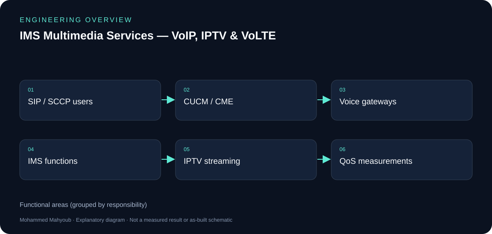

*New explanatory diagram; grouped responsibilities, not an as-built schematic or test result.*

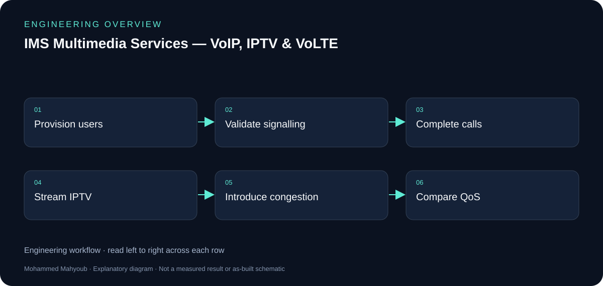

*New explanatory workflow; a documentation aid, not evidence that every proposed check was performed.*

## Separate the two evidence sets

The project material describes Cisco CUCM/CME voice services, VLC IPTV and OPNET analysis of an LTE-like access network and IMS core. The reproducible extension uses Kamailio, Asterisk and Mininet. Its measured QoS figures must not be presented as measurements from a commercial operator network.

## Signalling and media

SIP registration and call setup are control exchanges; voice and IPTV carry the media. A call that registers successfully may still suffer media loss or delay, which is why the documentation includes signalling flow and traffic measurements.

## QoS and multicast

The committed experiments compare congested FIFO with EF/CS3 priority treatment and compare multicast distribution for multiple IPTV viewers. Read MOS, loss and traffic-volume charts with the stated topology, workload and measurement assumptions. They are evidence for the experiment rather than a universal service guarantee.

## Evidence to review or collect

The following are suggested review checks. A checklist entry is not a claimed pass result.

- Registration and call setup traces.
- Successful media paths.
- Delay/loss/MOS measurement assumptions.
- Multicast subscriptions and trunk traffic.

## Source gallery

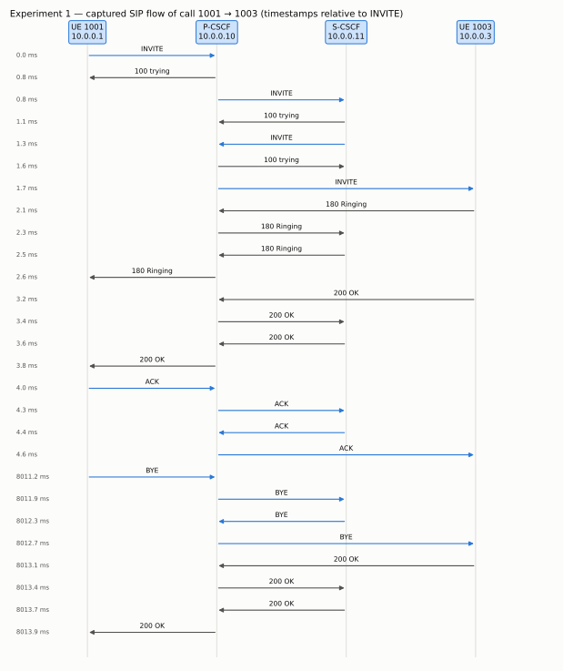

*exp1 sip call flow.*

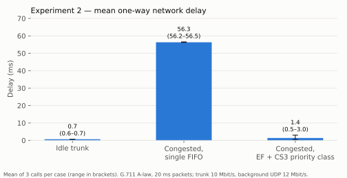

*exp2 delay.*

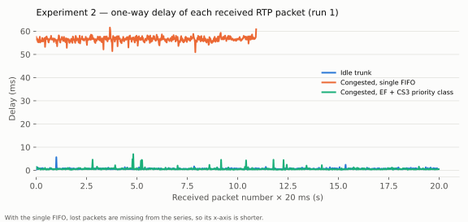

*exp2 delay series.*

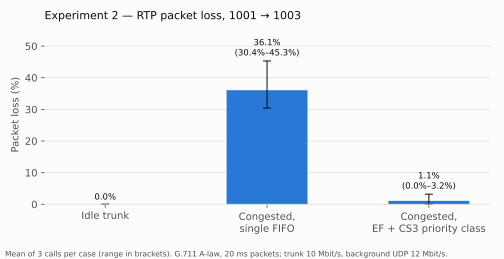

*exp2 loss.*

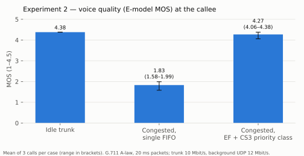

*exp2 mos.*

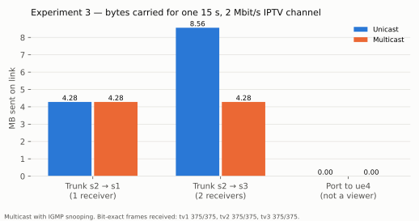

*exp3 iptv link bytes.*

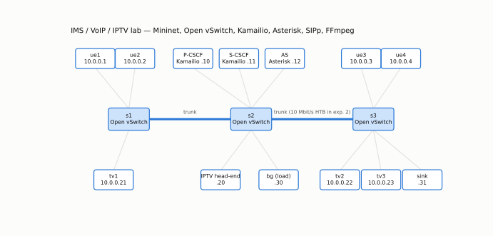

*topology.*

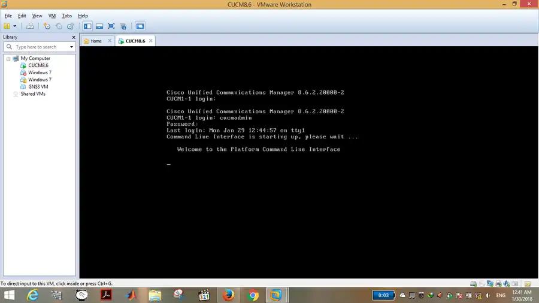

*cucm cli vmware.*

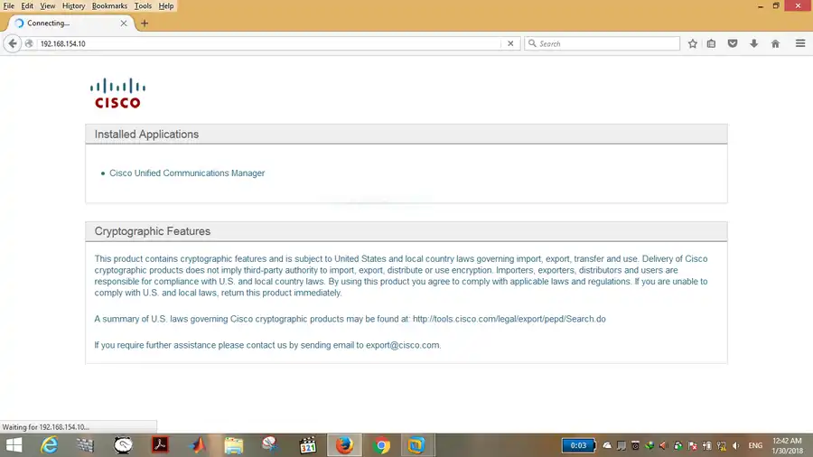

*cucm web admin.*

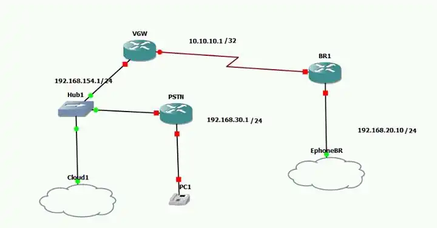

*gns3 voice topology.*

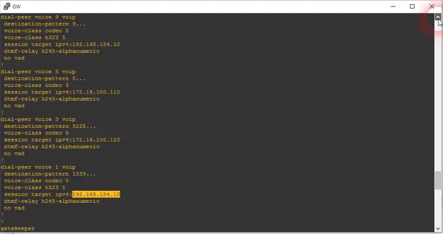

*gw voip dial peers.*

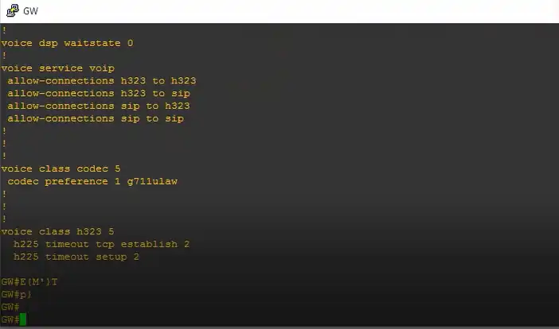

*gw codec h323 interworking.*

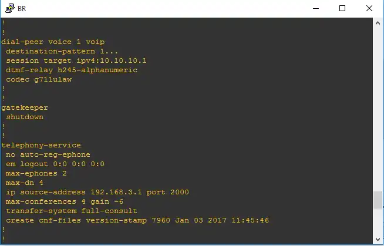

*br cme telephony service.*

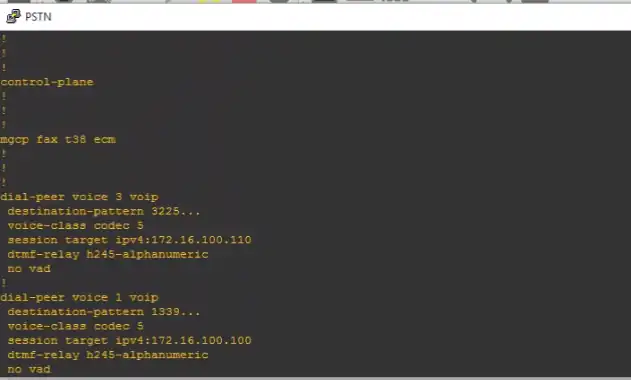

*pstn dial peers.*

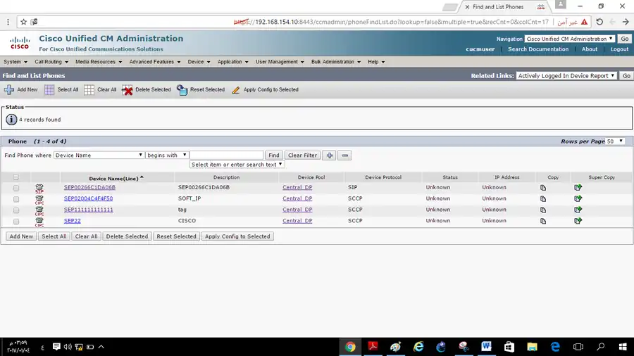

*cucm registered phones.*

*media5 android sip phone.*

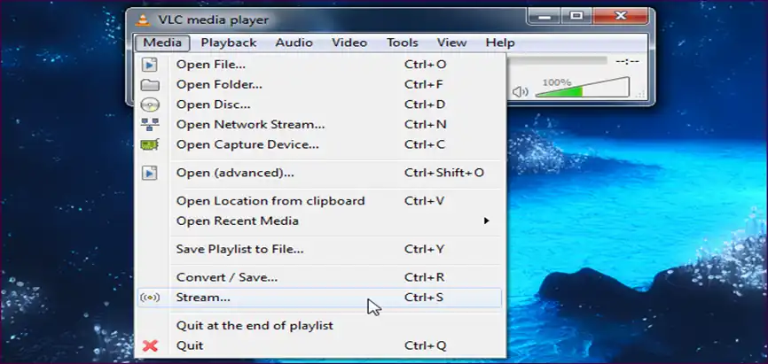

*vlc network stream.*

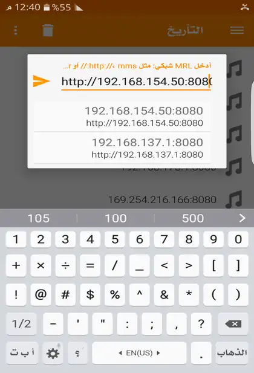

*iptv on mobile.*

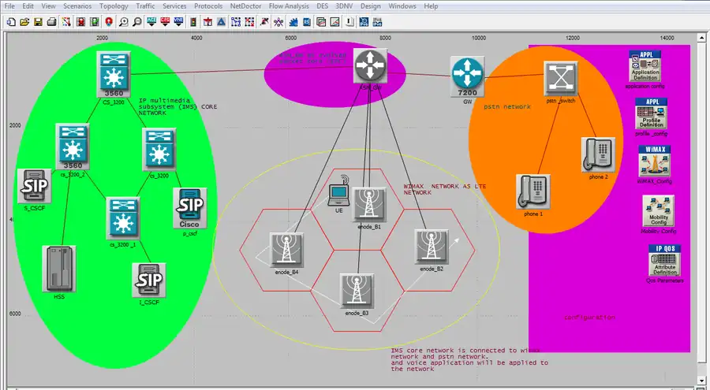

*opnet ims lte pstn topology.*

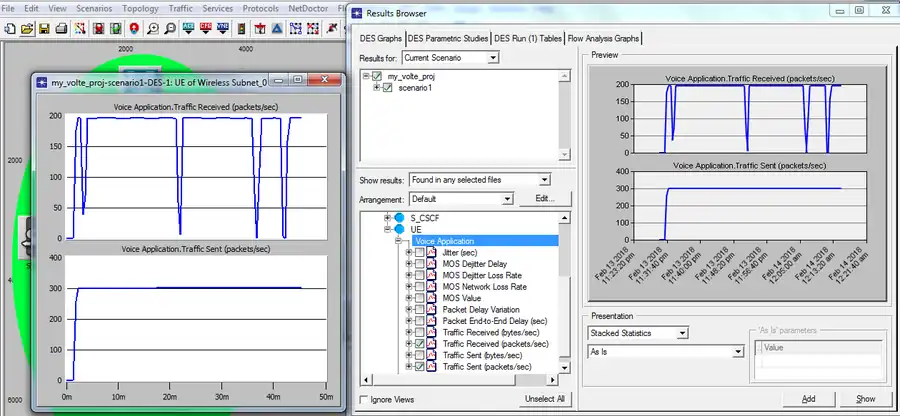

*opnet handover voice traffic.*

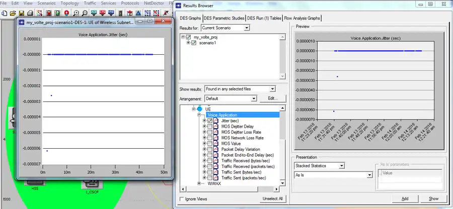

*opnet jitter.*

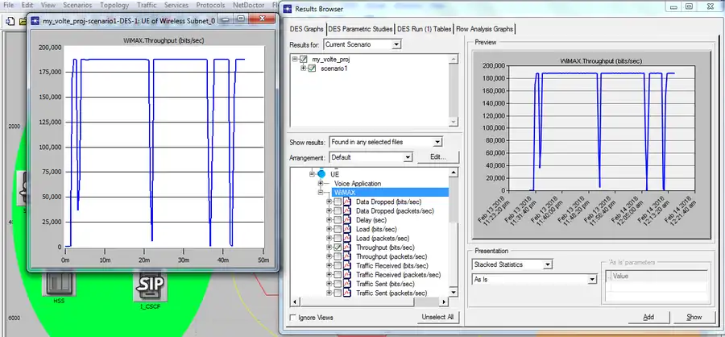

*opnet throughput.*

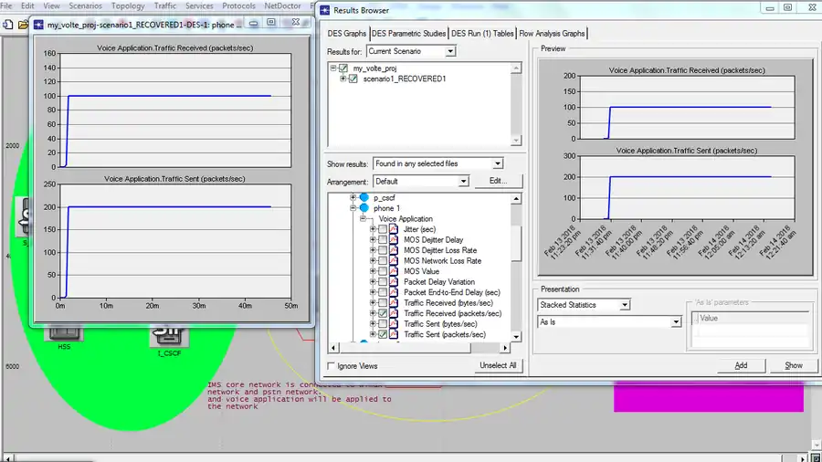

*opnet pstn voice calls.*

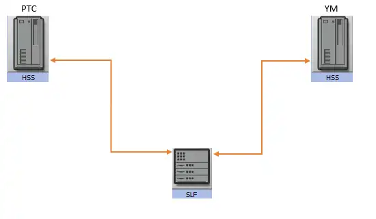

*case two hss with slf.*

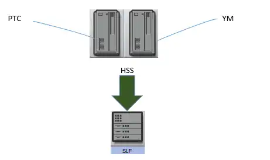

*case shared hss.*

## Sources and provenance

- [Published portfolio description](https://mahyoub88.github.io/projects/proj-ims-voip-volte/).
- [Project README](../README.md) and existing repository files.
- [LinkedIn projects](https://www.linkedin.com/in/mohammed-mahyoub/details/projects/): supplementary descriptions and project media.
- New SVG figures and explanatory text were authored for this documentation update; they are not original photographs or new measured results.
